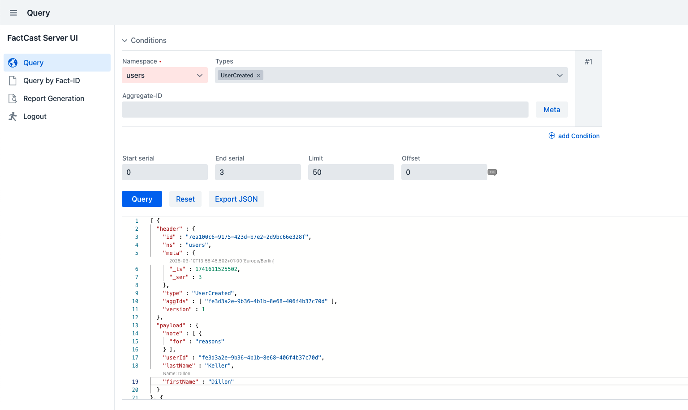

= UI
:icons: font

== FactCast-Server UI

The FactCast-Server UI is an easy to use UI based on Vaadin, that optionally can be plugged into FactCast. It allows to
conveniently query for facts, without requiring knowledge of a query language or database access.

== Setup

In order to setup and FactCast-Server-UI in your environment go through the following sections:

First, decide on a xref:ROOT:UI/deployment-options.adoc[deployment option] and configure the
xref:ROOT:UI/properties.adoc[necessary Vaadin property].

There are also several options regarding xref:ROOT:UI/security.adoc[security].

If you want to persist reports generated by users somewhere else than on the instance's filesystem take a look at
xref:ROOT:UI/report_storage.adoc[report storage].

Last but not least xref:ROOT:UI/plugins.adoc[plugins] allow you to customize your FactCast-Server-UI experience further.