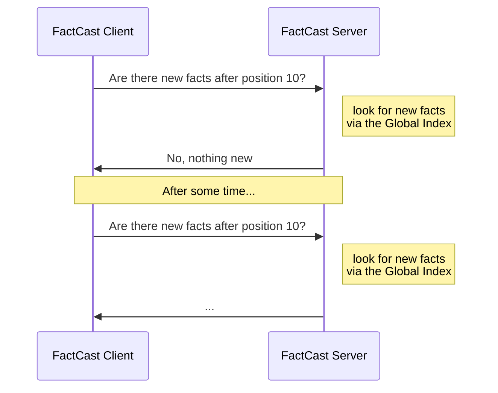
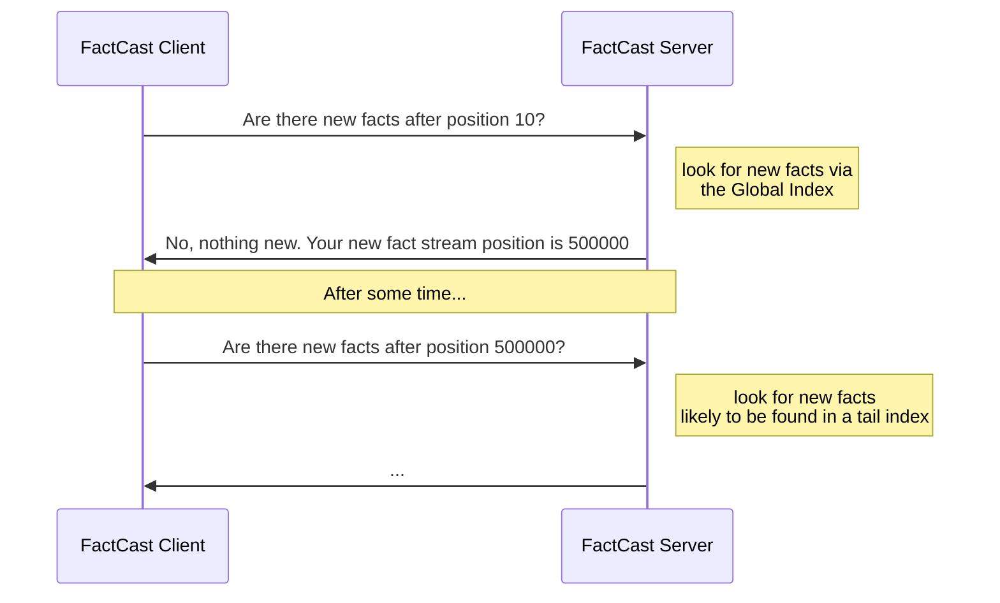

+++
title = "Tail Indexing"
identifier = "tail"
weight = 220
type="docs"
+++

The _tail index_ is a performance optimization for FactCast which speeds up queries
against the end (the _tail_) of the fact log.

## Background

### Global Index

FactCast uses a Postgres database for its persistence. Facts live in a single database table
called _fact_ which is referred to as the _fact log_. To speed up access to the fact log,
a [global index](https://www.postgresql.org/docs/11/textsearch-indexes.html) is used.
However, as the fact log is constantly growing, so is the index.
With the global index alone, query performance decreases over time.

### Subscription Phases

In general, [subscriptions]() may consist of two possible phases:

1. Catching up with past events, that have not yet been processed by the consumer
2. Checking for new events by querying the tail of the fact log

{}

- Non-follow subscriptions only consist of phase one (they complete after catching up with the past)
- Follow subscriptions consist of phase one and two
- Ephemeral subscriptions, only consist of phase two (ignore the past and just listen to facts as they are published)
  {}

## Tail Indexes

A _tail index_ supports the regular "are there new events (since X)?" queries by creating additional smaller partial indexes
at _the end_ of the fact log:

More precisely, FactCast maintains a certain number of rolling partial (tail) indexes.
When asked to query facts from the end of the fact log,
the Postgres database now has the option to use the smaller tail index, which (as many queries are concerned with the tail of the fact log) is likely to be cached in memory.

Tail index rotation is configurable and described in [the configuration properties]().

{}
Tail indexes are implemented as [Postgres Partial Indexes](https://www.postgresql.org/docs/11/indexes-partial.html).
with enabled [fastupdate](https://www.postgresql.org/docs/11/sql-createindex.html).
{}

### Index Maintenance Trade-Off

Introducing a new index does not come for free. When new facts are INSERTed, the Postgres database needs to maintain
the indexes of the fact log. Hence, the higher the number of indexes, the slower the INSERT performance.
See the [recommendations of the configuration section]() for sensible values
on the number of tail index generations.

If you encounter performance issues, see the [Postgres documentation](https://www.postgresql.org/docs/11/gin-implementation.html#GIN-FAST-UPDATE) for further advice.

### Fast-Forward

The Fast-Forward feature further improves the effectiveness of tail indexes by pushing a client's fact stream position to the end of the fact stream where possible.

Based on the fact log diagram above, here is an example of how a regular check for new events without Fast-Forward would work:

The client asks the server for new events after its current fact stream position, "10" using a non-follow subscription. Since
this position is not within the bounds of the tail of the fact log anymore, the FactCast database has to scan the global index
to check for new facts, which will take some time.
As there are no recent events, the fact stream position stays at where it is, and after a while,
the same expensive query via the global index might be repeated, given that there were no new facts of interest to this particular subscription published.

With Fast-Forward however, the situation is different:

Here, the client still asks the server for new events after its current position "10". Again,
the FactCast database has to use the global index. However, besides informing that no new events were found,
the client is fast-forwarded to position "500000" in the fact stream, which is the current beginning of the latest tail index.

Looking at the diagram of the fact log above, we see that position
"500000" is the beginning of the most recent tail index #1. On its next call, the client uses this position as the start of the fact stream.
Since this position is covered by a tail index, FactCast can scan much quicker for new events than before.

Fast-Forward can be imagined like a magnet on the right hand, tail side of the fast stream: Whenever possible,
FactCast tries to drag clients from a behind position to the tail of the fact stream in order to avoid scanning the same index again, once the consumer comes back asking for "Any news?".

{}

- To omit unnecessary writes of the fact stream position on the client-side, FactCast always offers the beginning of
  the currently latest tail index to the client.
- Fast-Forward is a client- and server-side feature of **FactCast 0.4.0** onward. However, older clients remain compatible
  with a newer FactCast server as the additional Fast-Forward notification is not sent.

{}
