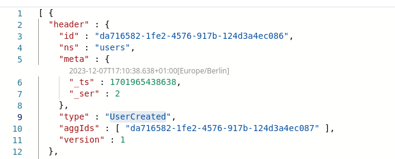

## Plugins

FactCast Server UI is extensible using Plugins. Those plugins can be handy for enriching the plain fact information you
see.

### Scenario

Consider you have the following Events:

- UserRegistered
- UserLogin

where UserRegistered has a UserId and a UserName, and UserLogin is emitted after a succesful login, having just the
UserId.

Now, when you look at UserLogin Events through the UI, the UserId is all you see, because thats all the json there is to
your fact payload. However it might be nice to know the UserName for a UserId when you look at it. Also it would be
cool, to 'annotate' the Json with that information. This can be done by building custom Plugins:
In the client, you'd know what to do: Build a projection that consumes all the UserRegistered Events to provide a
queryable Map<UserId, UserName>.

If you now do this in a Plugin, it gives you an API to inspect and annotate the Json that will be displayed to the User.

### Getting started

Take a look at `HeaderMetaTimestampToDatePlugin` as an example of the simplest Plugin possible, that just turns the `meta_.ts` attribute of the fact header into a human readable DateTime.

