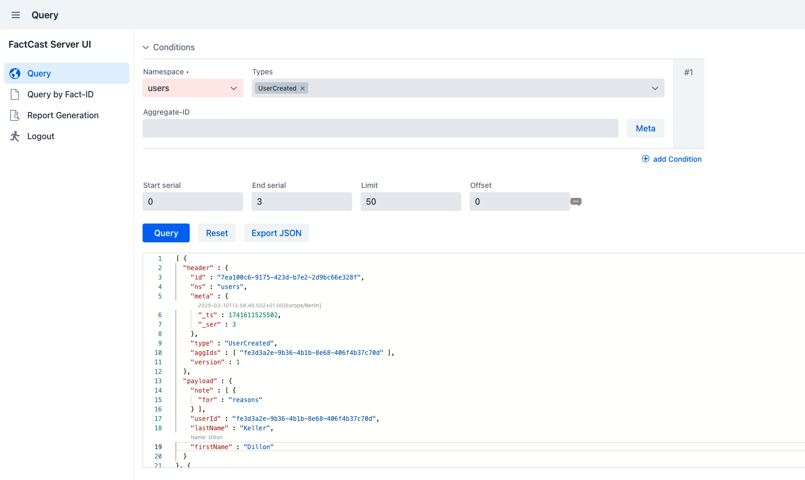

## FactCast-Server UI

The FactCast-Server UI is an easy to use UI based on Vaadin, that optionally can be plugged into FactCast. It allows to
conveniently query for facts, without requiring knowledge of a query language or database access.

Learn [here](Setup) how to set it up in your environment.
