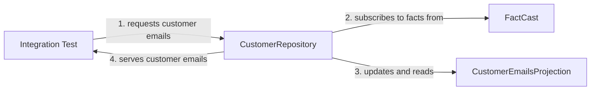

## Introduction

An event sourced application usually performs [two kinds of interaction]() with the FactCast server:
- It subscribes to facts and builds up use-case specific views of the received data. These use-case specific views are called *projections*.   
- It writes new facts to the event log.

{}
Building up *projections* works on both API levels, low-level and Factus. 
However, to simplify development, the high-level Factus API has [explicit support for this concept]().
{}
 
### Unit Tests

*Projections* are best tested in isolation, ideally at unit test level. 
At the end they are classes receiving facts and updating some internal state. 
As we will see in a moment, a unit test is a perfect fit here. 
However, as soon as the projection's state is externalized (e.g. [see here]()) this test approach can get challenging. 

### Integration Tests

Integration tests check the interaction of more than one component (usually a class) - hence the name. 
For example, you would use an integration test to confirm that a request at the REST layer really led to an event being published. 
Furthermore, integration tests can also help to validate the correct behaviour of
a projection which uses external state like a Postgres database.

{}
Be aware that FactCast integration tests startup real infrastructure via Docker. 
For this reason they are *a magnitude slower than unit tests*.
{}

----

## Testing FactCast (low-level)

In this section introduces the `CustomerEmails` projection for which we will then write unit- as well as integration tests.
For interaction with FactCast we are using the low-level API.

### The Customer Emails Projection

Imagine our application needs a unique list of customer emails. To provide this information we identified these facts which contain the relevant data:
- `CustomerAdded`
- `CustomerEmailChanged`
- `CustomerRemoved`

`CustomerAdded` and `CustomerEmailChanged` both contain a customerId and the email address. The `CustomerRemoved` fact only carries the customerId.

Here is a possible projection using the FactCast low-level API:

```java
public class CustomerEmailsProjection {

    private ObjectMapper objectMapper = new ObjectMapper();
    private Map<UUID, String> customerEmails = new HashMap<>();
    
    public Set<String> getCustomerEmails() {
        return new HashSet<>(customerEmails.values());
    }

    public void dispatchFacts(Fact fact) {
        switch (fact.type()) {
            case "CustomerAdded": handleCustomerAdded(fact); break;
            case "CustomerEmailChanged": handleCustomerEmailChanged(fact); break;
            case "CustomerRemoved": handleCustomerRemoved(fact); break;
            default: log.error("Fact type {} not supported", fact.type()); break;
        }
    }

    private void handleCustomerAdded(Fact fact) {
        var payload = parsePayload(fact);
        customerEmails.put(getCustomerId(payload), payload.get("email").asText());
    }

    private void handleCustomerEmailChanged(Fact fact) {
        var payload = parsePayload(fact);
        customerEmails.put(getCustomerId(payload), payload.get("email").asText());
    }

    private void handleCustomerRemoved(Fact fact) {
        var payload = parsePayload(fact);
        customerEmails.remove(getCustomerId(payload));
    }

    private JsonNode parsePayload(Fact fact) {
        return objectMapper.readTree(fact.jsonPayload());
    }

    private UUID getCustomerId(JsonNode payload) {
        return UUID.fromString(payload.get("id").asText());
    }
}
```

The method `dispatchFacts` acts as an entry point for the projection. It receives a `Fact` from the caller and further dispatches it to the appropriate handler method.
Inside a handler method first the fact's JSON payload is parsed using the Jackson library. 
Then the internal state of the projection, the `customerEmails` map, is updated. The handler for `CustomerAdded` adds a new entry to the map. When handling the `CustomerEmailChanged` fact, an existing entry is updated. Finally, a `CustomerRemoved` fact removes a customer's entry from the `customerEmails` map.

To provide our application with the unique list of customer emails, the `getCustomerEmails()` method
returns the values of our internal `customerEmails` map wrapped in a Set.

### Unit Testing A Projection

Looking at the projection code above we see that there are no external dependencies. Instead, we receive `Fact` objects as input and return a customized view of the internal data.

A unit test for this is straight forward, let's look at an example for the `CustomerAdded` fact:

```java
@Test
void emailIsAdded() {
    // arrange
    Fact customerAdded = Fact.builder()
            .id(UUID.randomUUID())
            .ns("user")
            .type("CustomerAdded")
            .version(1)
            .build(String.format(
                    "{\"id\":\"%s\", \"email\": \"%s\"}",
                    UUID.randomUUID(),
                    "customer@bar.com"));
    
    // act
    var uut = new CustomerEmailsProjection()
    uut.dispatchFacts(customerAdded);
    var emails = uut.getCustomerEmails();

    // assert
    assertThat(emails).hasSize(1);
    assertThat(emails).containsExactly("customer@bar.com");
}
```

First, we create a test `CustomerAdded` fact using the convenient builder the `Fact` class is providing.
Then, we let the newly created `CustomerEmailsProjection` class deal with our test fact by passing it to the `dispatchFacts` method. 
As the last step we check if the returned `Set` of emails corresponds to our expectations.

The unit tests for the remaining two other facts look very similar, so they are left out here.
However, you can find the full test code [here](https://github.com/factcast/factcast/tree/master/factcast-itests/factcast-itests-doc/src/test/java/org/factcast/itests/docexample/factcastlowlevel/CustomerEmailsProjectionTest.java).  

To conclude, checking your projection's logic should be done with unit tests as they are simple and fast to execute. At some point though, you want to test if your code really is able to communicate with FactCast and this is where integration tests come in. 

### Integration Tests

FactCast supports you in writing integration test by providing you a Junit5 extension which 
automatically provides you with the required 

As discussed [here](), FactCast comes with a Junit5 extension which simplifies a local integration testing a lot.


{}
The example below uses Spring Boot. However, as the Junit5 extension is framework-agnostic
you are free to go different directions (e.g. using Quarkus).
{}

#### Preparation

Before writing your first integration test
- make sure Docker is installed and running on your machine
- add the `factcast-test` module to your `pom.xml`:

```xml
<dependency>
  <groupId>org.factcast</groupId>
  <artifactId>factcast-test</artifactId>
  <version>${factcast.version}</version>
</dependency>
```

#### Test Scenario

Here is an overview of the scenario we will write an integration test for:



Our integration test is still interested in customer emails. However, instead of directly talking to the projection we now communicate with a `CustomerRepository` (1). This class encapsulate the details of the FactCast communication. It will first subscribe to the three relevant facts, `CustomerAdded`, `CustomerEmailChanged` and `CustomerRemoved` from FactCast (2). It will then use this subscription to
update the `CustomerEmailsProjection` (3). When all facts are applied, the repository will ask
the projection for customer emails and will delegate the result back to the integration test (4).

Notice that, compared to the unit test, our test scope is larger and contains the `CustomerRepository`,
FactCast and the `CustomerEmailsProjection`.

Before we start working on our integration test, let's have a quick look at the new `CustomerRepository`.

#### The Customer Repository

The `CustomerRepository` class encapsulates the interaction between FactCast and the `CustomerEmailsProjection`. As currently the only duty of this repository is to find out about customer emails, the implementation is rather slim:

```java
@Component
public class CustomerRepository {

    @Autowired
    FactCast factCast;

    public Set<String> getCustomerEmails() {
        var subscriptionRequest = SubscriptionRequest
                .catchup(FactSpec.ns("user").type("CustomerAdded"))
                .or(FactSpec.ns("user").type("CustomerEmailChanged"))
                .or(FactSpec.ns("user").type("CustomerRemoved"))
                .fromScratch();

        var projection = new CustomerEmailsProjection();
        factCast.subscribe(subscriptionRequest, projection::dispatchFacts).awaitComplete();
        return projection.getCustomerEmails();
    }
}
```

Using a `SubscriptionRequest`, we define that we are interested in facts of type `CustomerAdded`, `CustomerEmailChanged` and `CustomerRemoved`. All of these facts live in the "user" namespace. 
We then instruct FactCast to fetch the specified facts and send them to the `dispatchFacts` method of our `CustomerEmailsProjection`. To ensure that also the latest facts are applied, the subscription
blocks until the last fact was processed by the projection. Now that the projection is up-to-date 
we return the customers emails.

After we are aware of what we need to test, let's look at how it is done.

#### Writing The Integration Test


As discussed [here](), FactCast comes with a Junit5 extension which simplifies a local integration testing a lot.

As mentioned before, this example assumes that you are using the Java FactCast client in combination with Spring Boot. 

```java
@SpringBootTest
@DirtiesContext(classMode = DirtiesContext.ClassMode.BEFORE_EACH_TEST_METHOD)
@ExtendWith({FactCastExtension.class})
public class CustomerEmailsProjectionITest {

    @Autowired FactCast factCast;
    @Autowired CustomerRepository uut;

    @Test
    void emailOfSingleCustomer() {
        UUID customerId1 = UUID.randomUUID();
        Fact customer1Added = Fact.builder()
                .id(UUID.randomUUID())
                .ns("user")
                .type("CustomerAdded")
                .version(1)
                .build(String.format(
                        "{\"id\":\"%s\", \"email\": \"%s\"}",
                        customerId1,
                        "customer1@bar.com"));

        factCast.publish(customer1Added);

        var customerEmails = uut.getCustomerEmails();
        assertThat(customerEmails).hasSize(1);
        assertThat(customerEmails).containsExactly("customer1@bar.com");
    }
```


First a `SubscriptionRequest` is created which 

Please see here for details on how to use the FactCast low-level API, see 


## Testing with Factus

Factus builds up on the low-level FactCast API and provides a higher level of abstraction.  
As with the direct FactCast API described before 

TODO: show Redis Map example
TODO: Fact vs `Fact` vs fact vs Event
TODO FactCast vs FactCast

- challenges: state external like Redis or Postgres: Try to 

