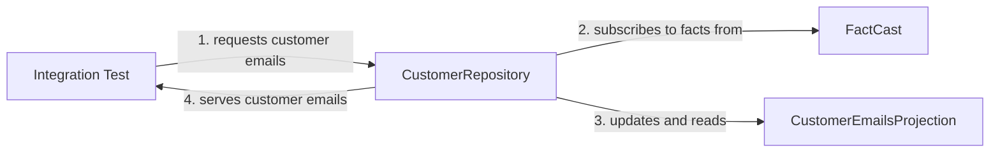

## Introduction

An event-sourced application usually performs [two kinds of interaction]() with the FactCast server:
- It subscribes to facts and builds up use-case specific views of the received data. These use-case specific views are called *projections*.   
- It writes new facts to the event log.

{}
Building up *projections* works on both API levels, low-level and Factus. 
However, to simplify development, the high-level Factus API has [explicit support for this concept]().
{}
 
### Unit Tests

*Projections* are best tested in isolation, ideally at the unit test level. 
In the end, they are classes receiving facts and updating some internal state. 
As we will see in a moment, a unit test is a perfect fit here. 
However, as soon as the projection's state is externalized (e.g. [see here]()) this test approach can get challenging. 

### Integration Tests

Integration tests check the interaction of more than one component (usually a class) - hence the name. 
For example, you would use an integration test to confirm that a request at the REST layer led to an event being published. 
Furthermore, integration tests can also help validate the correct behaviour of a projection that uses an external data store like a Postgres database.

{}
Be aware that FactCast integration tests startup real infrastructure via Docker. 
For this reason, they are *a magnitude slower than unit tests*.
{}

----

## Testing FactCast (low-level)

This section introduces the `CustomerEmails` projection for which we will write 
- unit tests and 
- integration tests.

For interaction with FactCast we are using here the low-level API.

### The Customer Emails Projection

Imagine our application needs a unique list of customer emails. To provide this information, we identified these facts which contain the relevant data:
- `CustomerAdded`
- `CustomerEmailChanged`
- `CustomerRemoved`

`CustomerAdded` and `CustomerEmailChanged` both contain a customer ID and the email address. 
The `CustomerRemoved` fact only carries the customer ID.

Here is a possible projection using the FactCast low-level API:

```java
public class CustomerEmailsProjection {

    private ObjectMapper objectMapper = new ObjectMapper();
    private Map<UUID, String> customerEmails = new HashMap<>();
    
    public Set<String> getCustomerEmails() {
        return new HashSet<>(customerEmails.values());
    }

    public void apply(Fact fact) {
        switch (fact.type()) {
            case "CustomerAdded": handleCustomerAdded(fact); break;
            case "CustomerEmailChanged": handleCustomerEmailChanged(fact); break;
            case "CustomerRemoved": handleCustomerRemoved(fact); break;
            default: log.error("Fact type {} not supported", fact.type()); break;
        }
    }

    @VisibleForTesting
    void handleCustomerAdded(Fact fact) {
        var payload = parsePayload(fact);
        customerEmails.put(getCustomerId(payload), payload.get("email").asText());
    }

    @VisibleForTesting
    void handleCustomerEmailChanged(Fact fact) {
        var payload = parsePayload(fact);
        customerEmails.put(getCustomerId(payload), payload.get("email").asText());
    }

    @VisibleForTesting
    void handleCustomerRemoved(Fact fact) {
        var payload = parsePayload(fact);
        customerEmails.remove(getCustomerId(payload));
    }

    @SneakyThrows
    private JsonNode parsePayload(Fact fact) {
        return objectMapper.readTree(fact.jsonPayload());
    }

    private UUID getCustomerId(JsonNode payload) {
        return UUID.fromString(payload.get("id").asText());
    }
}
```
The method `apply` acts as an entry point for the projection. It receives a `Fact` from the caller and further dispatches it to the appropriate handler method.
Inside a handler method, the `Fact` object's JSON payload is parsed using the Jackson library. 
Then the internal state of the projection, the `customerEmails` map, is updated. 
The handler for `CustomerAdded` adds a new entry to the map. 
When handling the `CustomerEmailChanged` fact, an existing entry is updated. 
Finally, a `CustomerRemoved` fact removes a customer's entry from the `customerEmails` map.

To provide our application with a unique list of customer emails, the `getCustomerEmails()` method
returns the values of our internal `customerEmails` map wrapped in a `Set`.

### Unit Testing A Projection

Looking at the projection code above, we see that there are no external dependencies. 
Instead, we receive `Fact` objects as input and return a customized view of the internal state.

A unit test for this is straight forward, let's look at an example for the `CustomerAdded` fact:

```java
@Test
void emailIsAdded() {
    // arrange
    Fact customerAdded = Fact.builder()
        .id(UUID.randomUUID())
        .ns("user")
        .type("CustomerAdded")
        .version(1)
        .build(String.format(
            "{\"id\":\"%s\", \"email\": \"%s\"}",
            UUID.randomUUID(),
            "customer@bar.com"));
        
    // act
    CustomerEmailsProjection uut = new CustomerEmailsProjection();
    uut.handleCustomerAdded(customerAdded);
    var emails = uut.getCustomerEmails();

    // assert
    assertThat(emails).hasSize(1);
    assertThat(emails).containsExactly("customer@bar.com");
}
```

First, we create a test `CustomerAdded` fact using the convenient builder the `Fact` class is providing.
Then, we let the newly created `CustomerEmailsProjection` class deal with our test fact by passing it to 
its dedicated handler method `handleCustomerAdded`. 
As the last step, we check if the returned `Set` of emails corresponds to our expectations.

Since the focus of the unit test is on *the details of how a fact is handled*, 
we execute the handler method `handleCustomerAdded` directly. 
However, [the full unit test](https://github.com/factcast/factcast/tree/master/factcast-itests/factcast-itests-doc/src/test/java/org/factcast/itests/docexample/factcastlowlevel/CustomerEmailsProjectionTest.java)
also contains a test for the dispatching logic of the `apply` method.
Additionally, the unit tests for the remaining two other handlers look very similar.
They are also left out here but are part of [the complete test code](https://github.com/factcast/factcast/tree/master/factcast-itests/factcast-itests-doc/src/test/java/org/factcast/itests/docexample/factcastlowlevel/CustomerEmailsProjectionTest.java).  

To conclude, checking your projection's logic should be done with unit tests as they are fast and straightforward to execute. At some point, though, you want to test if your code really can communicate with FactCast, which is where integration tests come in. 

### Integration Tests

When writing integration tests, FactCast tries to support you as much as possible.
Thus, it [provides a Junit5 extension]() which 
starts a FactCast server plus its Postgres database in the background.
These two components are pre-configured and are ready to use.  


{}
The example below uses Spring Boot. However, as the Junit5 extension is framework-agnostic
you are free to go in different directions (e.g. using Quarkus).
{}

#### Preparation

Before writing your first integration test
- make sure Docker is installed and running on your machine
- add the `factcast-test` module to your `pom.xml`:

```xml
<dependency>
  <groupId>org.factcast</groupId>
  <artifactId>factcast-test</artifactId>
  <version>${factcast.version}</version>
</dependency>
```

- to allow TLS free authentication between our test code and the local FactCast server, create an `application.properties` file in the project's `resources` directory with the following content:
```properties
grpc.client.factstore.negotiationType=PLAINTEXT
```

#### Writing The Integration Test

Our integration test builds upon the previous unit test example. This time however, we want to check if the 
`CustomerEmailsProjection` can also be updated by a real FactCast server:

```java
@SpringBootTest
@DirtiesContext(classMode = DirtiesContext.ClassMode.BEFORE_EACH_TEST_METHOD)
@ExtendWith(FactCastExtension.class)
public class CustomerEmailsProjectionITest {

    @Autowired FactCast factCast;
    @Autowired CustomerEmailsProjection uut;

    private class FactObserverImpl implements FactObserver {
        @Override
        public void onNext(@NonNull Fact fact) {
            uut.apply(fact);
        }
    }

    @Test
    void emailOfSingleCustomer() {
        // arrange
        UUID customerId1 = UUID.randomUUID();
        Fact customer1Added = Fact.builder()
                .id(UUID.randomUUID())
                .ns("user")
                .type("CustomerAdded")
                .version(1)
                .build(String.format(
                        "{\"id\":\"%s\", \"email\": \"%s\"}",
                        customerId1,
                        "customer1@bar.com"));

        factCast.publish(customer1Added);

        // act
        var subscriptionRequest = SubscriptionRequest
                .catchup(FactSpec.ns("user").type("CustomerAdded"))
                .or(FactSpec.ns("user").type("CustomerEmailChanged"))
                .or(FactSpec.ns("user").type("CustomerRemoved"))
                .fromScratch();

        factCast.subscribe(subscriptionRequest, new FactObserverImpl()).awaitComplete();

        // assert
        var customerEmails = uut.getCustomerEmails();
        assertThat(customerEmails).hasSize(1);
        assertThat(customerEmails).containsExactly("customer1@bar.com");
    }
```

Let's got through this top-down and have a look at the annotations first. 
To use Spring's dependency injection, we define the test as `@SpringBootTest`. 
The `@DirtiesContext` configuration ensures that every single test is provided with fresh Spring beans. 
In our example, this annotation guarantees that each test is working with an empty `CustomerEmailsProjection`. 

The previously mentioned `FactCastExtension` starts the FactCast server
and the Postgres database *once* before the first test is executed. 
Between the tests, the extension wipes all old facts from the FactCast server 
so that you are guaranteed to always start from scratch.

Continuing in the code, the `emailOfSingleCustomer` 
test first arranges the test data by publishing a `CustomerAdded` fact to the local FactCast. 
In the middle "act" part, we create a `SubscriptionRequest` covering all the facts we are interested in. 
This subscription request is then used to `subscribe` to these facts.

To tell FactCast what to do with the received events, we provide a custom implementation of `FactObserver` as the second argument.
Once a fact is received, FactCast invokes the `onNext` method of the `FactObserverImpl`, which delegates to the `apply` method of the `CustomerEmailsProjection`.
 
The last "assert" part of our test is identical to the previous unit test. However, this time the real infrastructure was involved.

{}
For details of the FactCast low-level API please refer to [the API documentation]().
{}

### A Customer Repository

The integration test above aimed to show you the minimal required setup. 
However, in real life you would probably introduce a dedicated *Repository* to deal with all the 
details of the FactCast communication:



Now our integration test asks the `CustomerRepository` for customer emails (1). 
The `CustomerRepository` will first subscribe to the three relevant facts, `CustomerAdded`, `CustomerEmailChanged` and `CustomerRemoved` from FactCast (2). 
It will then use this subscription to update the `CustomerEmailsProjection` (3). 
When all facts are applied, the repository will query the projection for customer emails and 
will delegate the result back to the integration test (4).

Here is a possible implementation:
```java
@Repository
public class CustomerRepository {

    @Autowired FactCast factCast;

    public Set<String> getCustomerEmails() {
        var subscriptionRequest = SubscriptionRequest
                .catchup(FactSpec.ns("user").type("CustomerAdded"))
                .or(FactSpec.ns("user").type("CustomerEmailChanged"))
                .or(FactSpec.ns("user").type("CustomerRemoved"))
                .fromScratch();

        var projection = new CustomerEmailsProjection();
        class FactObserverImpl implements FactObserver {

            @Override
            public void onNext(@NonNull Fact fact) {
                projection.apply(fact);
            }
        }

        factCast.subscribe(subscriptionRequest, new FactObserverImpl()).awaitComplete();
        return projection.getCustomerEmails();
    }
}
```
You will notice is that we mostly moved the code concerning FactCast communication into the `CustomerRepository` class. 
A client now only needs to call `getCustomerEmails` without worrying about FactCast details to fetch customer emails.

The only difference in the implementation is that we have implemented the `FactObserverImpl` class inside the `getCustomerEmails` 
to provide a new projection with every call of `getCustomerEmails`. 
In a real live, however, you would probably not always fetch the events from scratch
but use a [follow subscription]().


-------
# Building site - no trespassing

## Testing with Factus

Factus builds up on the low-level FactCast API and provides a higher level of abstraction.  
As with the direct FactCast API described before 

TODO: show Redis Map example

- challenges: state external like Redis or Postgres: Try to 

