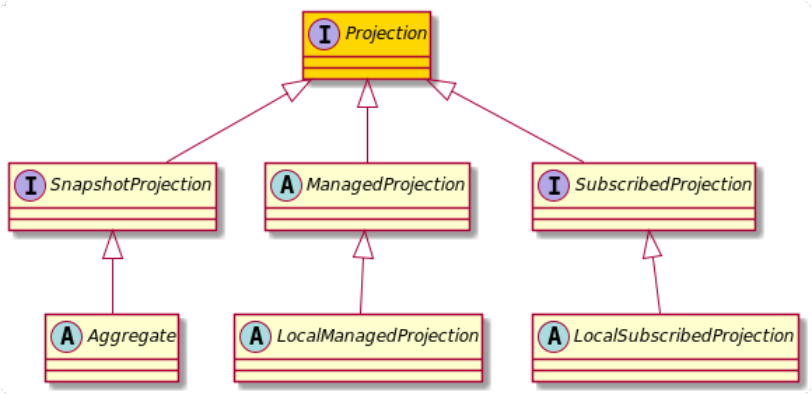

+++
title = "Projection"
type = "docs"
weight = 50

+++



Before we can look at processing Events, we first have to talk about another abstraction that does not exist in FactCast: `Projection`

```java
public interface Projection { ... }
```

In Factus, a Projection is any kind of state that is distilled from processing Events - in other words: `Projection`s process (or handle) events.

## Projections in general

What projections have in common is that they handle Events (or Facts). In order to express that, a projection can have any number of methods annotated with `@Handler` or `@HandlerFor`. These methods must be package-level/protected accessible and can be either on the Projection itself or on a nested (**non-static**) inner class.
A simple example might be:

```java
/**
 *  maintains a map of UserId->UserName
**/
public class UserNames implements SnapshotProjection {

    private final Map<UUID, String> existingNames = new HashMap<>();

    @Handler
    void apply(UserCreated created) {
        existingNames.put(created.aggregateId(), created.userName());
    }

    @Handler
    void apply(UserDeleted deleted) {
        existingNames.remove(deleted.aggregateId());
    }
// ...
```

Here the EventObject 'UserDeleted' and 'UserCreated' are just basically tuples of a UserId (aggregateId) and a Name (userName).
Also **projections must have a default (no-args) constructor**.

As we established before, you could also decide to use a nested class to separate the methods from other instance methods, like:

```java
public class UserNames implements SnapshotProjection {

    private final Map<UUID, String> existingNames = new HashMap<>();

    class EventProcessing {

        @Handler
        void apply(UserCreated created) {
            existingNames.put(created.aggregateId(), created.userName());
        }

        @Handler
        void apply(UserDeleted deleted) {
            existingNames.remove(deleted.aggregateId());
        }

    }
// ...
```

## many Flavours

There are several kinds of Projections that we need to look at. But before, let's start with [Snapshotting](snapshotting)...
