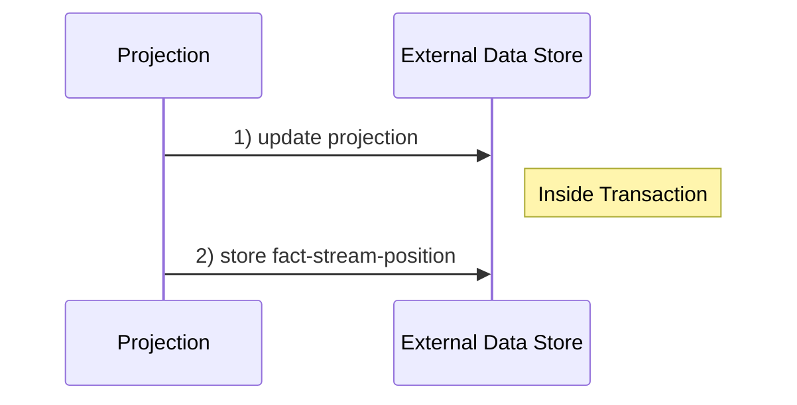
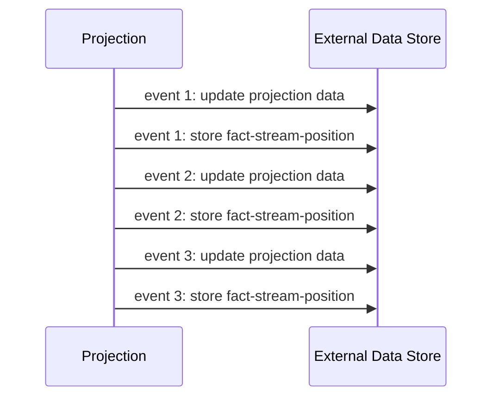
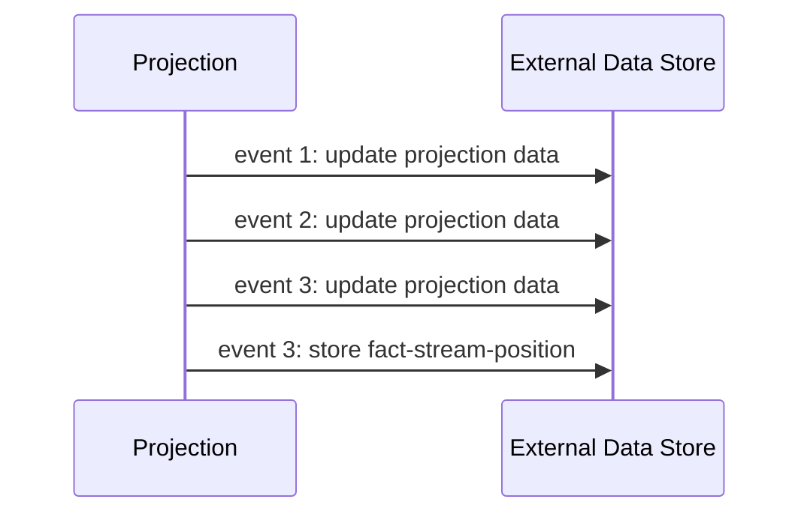

+++
title = "Atomicity"
type = "docs"
weight = 52

+++

{}
Atomic projections only make sense in terms of:

- [managed projections]() and for
- [subscribed projections]().

as _snapshot projections_ (including Aggregates) work with local state & externalized snapshots and thus are atomic by design.
{}

## Introduction

When processing events, an externalized projection has two tasks:

1. persist the changes resulting from the Fact
2. store the current fact-stream-position

When using an external datastore (e.g. Redis, JDBC, MongoDB), Factus needs to ensure that these two tasks happen atomically: either **both**
tasks are executed or **none**. This prevents corrupted data in case e.g. the Datastore goes down in the wrong moment.

Factus offers atomic writes through _atomic projections_.

_In an atomic Projection, the projection update and the update of the fact-stream-position need to run atomically_

Factus currently supports atomicity for the following external data stores:

- [data stores supported by Spring Transaction Management]() (e.g. JDBC / MongoDB / Cassandra)
- Redis
  - via [transactions]()
  - via [batching]()

{} There is an internal API available you can use to support your favorite data store. {}

## Configuration

Atomic projections are declared via specific annotations. Currently, supported are

- [`@SpringTransactional`](),
- [`@RedisTransactional`]() and
- [`@RedisBatched`]()

These annotations share a common configuration attribute:

| Parameter Name | Description                             | Default Value |
| -------------- | --------------------------------------- | ------------- |
| `bulkSize`     | how many events are processed in a bulk | 50            |

as well as, different attributes needed to configure the respective underlying technical solution (Transaction/Batch/...).
There are reasonable defaults for all of those attributes present.

## Optimization: Bulk Processing

In order to improve the throughput of event processing, atomic projections support _bulk processing_.

With _bulk processing_

- the concrete underlying transaction mechanism (e.g. Spring Transaction Management) can optimize accordingly.
- skipping unnecessary fact-stream-position updates is possible (see next section).

The size of the bulk can be configured via a common `bulkSize` attribute of
the `@SpringTransactional`, `@RedisTransactional` or `@RedisBatched` annotation.

Once the bulkSize is reached, or a configured timeout is triggered, the recorded operations of this bulk will be flushed to the datastore.

{} Bulk processing only takes place [in the `catchup` phase](/concept). {}

### Skipping fact-stream-position Updates

Skipping unnecessary updates of the fact-stream-position reduces the writes to the external datastore,
thus improving event-processing throughput.

The concept is best explained with an example: Suppose we have three events which are processed by a transactional projection and the bulk size set to "1".
Then, we see the following writes going to the external datastore:

_Processing three events with bulk size "1" - each fact-stream-position is written_  
As initially explained, here, each update of the projection is accompanied by an update of the fact-stream-position.

In order to minimize the writes to the necessary, we now increase the bulk size to "3":

_Processing three events with bulk size "3" - only the last fact-stream-position written_

This configuration change eliminates two unnecessary intermediate fact-stream-position updates.
The bulk is still executed atomically, so in terms of fact-stream-position updates, we are just interested
in the last, most recent position.

Skipping unnecessary intermediate updates to the fact-stream-position, noticeably reduces
the required writes to the external datastore. Provided a large enough bulk size ("50" is a reasonable default),
this significantly improves event-processing throughput.

{} 'Large enough' of course depends on multiple factors like network, storage, etc.
Your mileage may vary. {}
