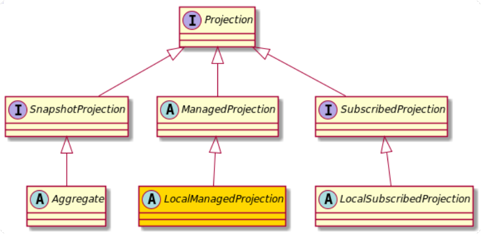

+++
title = "Managed (local)"
weight = 350
type = "docs"
+++



As a specialization of ManagedProjection, a LocalManagedProjection lives within the application
process and **does not use shared external Databases** to maintain its state.
Relying on the locality, locking and keeping track of the state (position in the eventstream) is
just a matter of synchronization and an additional field, all being implemented in the abstract
class `LocalManagedProjection` that you are expected to extend.

```java
public class UserCount extends LocalManagedProjection {

    private int users = 0;

    @Handler
    void apply(UserCreated created) {
        users++;
    }

    @Handler
    void apply(UserDeleted deleted) {
        users--;
    }

    int count() {
        return users;
    }

}
```

As you can see, the WriterTokenBusiness and the state management are taken care of for you, so that you can just
focus on the implementation of the projection.

Due to the simplicity of use, this kind of implementation would be attractive for starting
with for non-aggregates, assuming the data held by the Projection is not huge.
