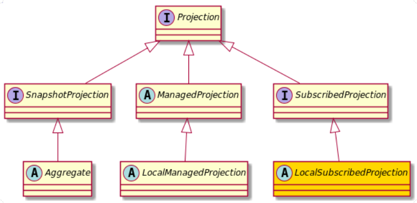

+++
title = "Subscribed (local)"
weight = 450
type = "docs"
+++

As a specialization of the `SubscribedProjection`, a `LocalSubscribedProjection` is local to one VM (just like a `LocalManagedProjection`).
This leads to the same problem already discussed in relation to `LocalManagedProjection`: A possible inconsistency between nodes.

A `LocalSubscribedProjection` is providing locking (trivial) and state awareness, so it is very easy to use/extend.
