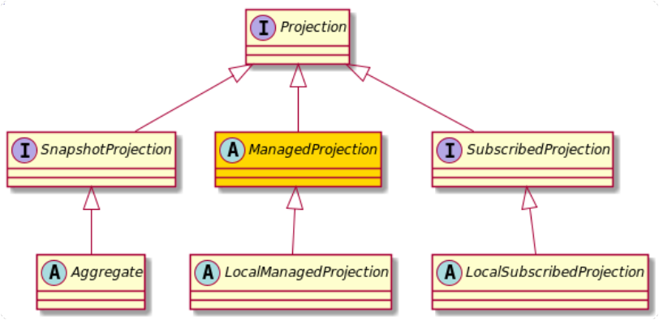

+++
title = "Managed"
weight = 300
type = "docs"
+++



As we have learnt, SnapshotProjections are created from scratch or from Snapshots, whenever you fetch them.
If you look at it from another angle, you could call them unmanaged in a sense, that the application has no
control over their lifecycle.
There are use cases where this is less attractive. Consider a query model that powers a high-traffic REST API.
Recreating an instance of a SnapshotProjection for every query might be too much of an overhead caused by the
network transfer of the snapshot and the deserialization involved.

Considering this kind of use, it would be good if the lifecycle of the Model would be managed by the application.
It also means, there must be a way to 'update' the model when needed (technically, to process all the Facts that have
not yet been applied to the projection).
However, if the Projection is application managed (so that it can be shared between threads) but needs to be updated
by catching up with the Fact-Stream, there is a problem we did not have with SnapshotProjections, which is
**locking**.

## Definition

A ManagedProjection is a projection that is managed by the Application. Factus can be used to lock/update/release
a Managed Projection in order to make sure it processes Facts in the correct order and uniquely.

Factus needs to make sure only one thread will change the Projection by catching up with the latest Facts.
Also, when Factus has no control over the Projection, the Projection implementation itself needs to ensure
that proper concurrency handling is implemented in the place the Projection is being queried from, while being updated.
Depending on the implementation strategy used by you, this might be something you don't need to worry about (for
instance when using a transactional datastore).

ManagedProjections are `StateAware` (they know their position in the FactStream) and `WriterTokenAware`, so that
they provide a way for Factus to coordinate updates.

## flexible update

One of the most important qualities of ManagedProjections is that they can be updated at any point.
This makes them viable candidates for a variety of use cases. A default one certainly is a "strictly consistent"
model, which can be used to provide consistent reads over different nodes that always show the latest state from
the fact stream. In order to achieve this, you'd just update the model before reading from it.

```java
// lets consider userCount is a spring-bean
UserCount userCount = new UserCount();

// now catchup with the published events
factus.update(userCount);
```

Obviously, this makes the application dependent on the event store for availability (and possibly latency).
The good part however is, that if FactCast was unavailable, you'd still have (a potentially) stale model you can
fall back to.

In cases where consistency with the fact-stream is not that important, you might just want to occasionally update
the model. An example would be to call update for logged in users (to make sure, they see their potential writes)
but not updating for public users, as they don't need to see the very latest changes.
One way to manage the extends of "staleness" of a ManagedProjection could be just a **scheduled update call**,
once every 5 minutes or whatever your requirements are for public users.

```java

private final UserCount userCount;
private final Factus factus;

@Scheduled(cron = "*/5 * * * *")
public void updateUserCountRegularly(){
    factus.update(userCount);
}

```

If the projection is externalized and shared, keep in mind that your users still get a consistent view of the system,
because all nodes share the same state.

## Typical implementations

ManagedProjections are often used where the state of the projection is externalized and potentially shared between
nodes. Think of JPA Repositories or a Redis database.

The ManagedProjection instance in the application should provide access to the externalized data and implement
the locking facility.

Over time, there will be some examples added here with exemplary implementations using different technologies.

However, ManagedProjections do not **have to** work with externalized state. Depending on the size of the
Projection and consistency requirements between nodes, it might also be a good idea to just have an in-process (local)
representation of the state. That makes at least locking much easier.

Let's move on to LocalManagedProjections...
