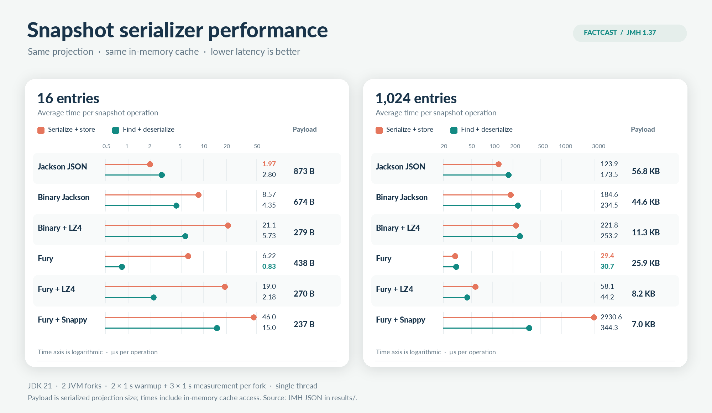

# Snapshot serialization benchmark

This JMH benchmark compares all current `SnapshotSerializer` implementations using the same
projection and `InMemorySnapshotCache`. It measures two paths separately:

- `serializeAndStore`: serialize a projection, wrap the bytes in `SnapshotData`, and store it.
- `findAndDeserialize`: find the cached `SnapshotData` and deserialize its projection.

The cache is initialized before measurement, so the read path always hits memory. The fixture has
16 or 1024 entries. Each trial checks a complete round trip and prints the serialized size.
Results are average microseconds per operation; compare rows with the same operation and entry
count. The cache work is included in both operations, but no disk, database, or network is used.

Build the benchmark and its dependencies:

```sh
mvnd -pl factcast-snapshot-serialization-benchmark -am \
  -Dmaven.compiler.proc=full -DskipTests test-compile
```

Run all variants from the repository root with a forked JVM (JDK 21):

```sh
mvnd -pl factcast-snapshot-serialization-benchmark \
  -Dexec.classpathScope=test -Dexec.executable=java \
  -Dexec.args='-cp %classpath org.openjdk.jmh.Main SnapshotSerializationBenchmark -f 2 -rf json -rff /tmp/snapshot-serialization-results.json' \
  exec:exec
```

Use JMH options in `-Dexec.args` to narrow cases or change run length. For example, add
`-p entryCount=1024 -wi 3 -i 5` after the benchmark name. Keep the JVM and JMH options identical
when comparing runs.

## Recorded comparison

The included run used JDK 21 on an AMD Ryzen 7 PRO 6850U, with two JVM forks, one thread,
two one-second warmup iterations and three one-second measurement iterations per fork. These
measurements describe this fixture and machine; the raw JMH output retains the score errors.



For 1,024 entries, Fury had the lowest write and read time (29.4 and 30.7 µs/op), while Fury +
LZ4 reduced its payload from 25.9 to 8.2 KB at roughly double the write time. For 16 entries,
Jackson had the lowest write time (1.97 µs/op) and Fury the lowest read time (0.83 µs/op).

The [JMH JSON](results/snapshot-serialization-jdk21.json) and
[serialized sizes](results/serialized-sizes.csv) are the chart inputs. To redraw the PNG, run
`python3 render_chart.py` from any directory with Pillow installed.
